# Lazarus Architecture Documentation

## System Overview

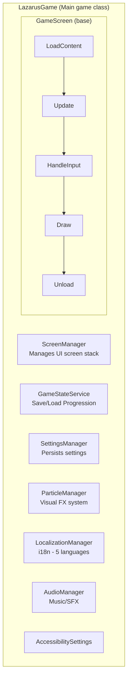

## Initialization Flow

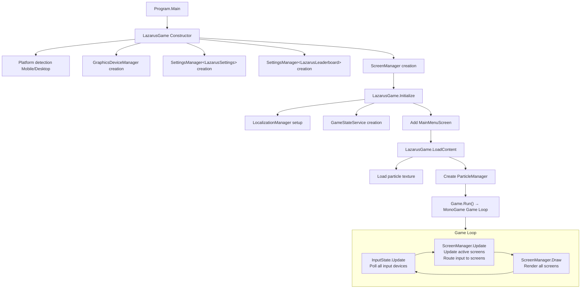

## Screen System Architecture

### Screen Lifecycle

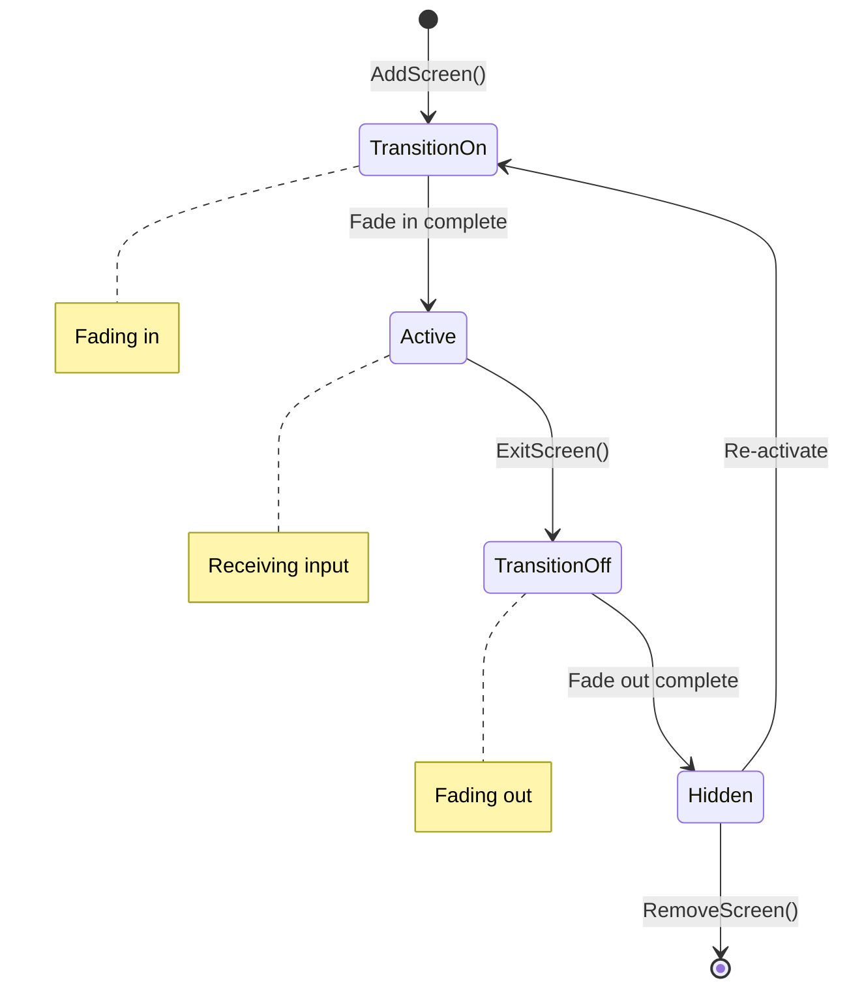

### Screen Stack Example

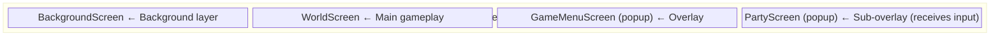

### Screen Inheritance Hierarchy

```mermaid
classDiagram
    GameScreen <|-- MenuScreen
    GameScreen <|-- WorldScreen
    GameScreen <|-- CombatScreen
    GameScreen <|-- DungeonScreen
    GameScreen <|-- DungeonExplorationScreen
    GameScreen <|-- BestiaryScreen
    GameScreen <|-- PartyScreen
    GameScreen <|-- RecruitmentScreen
    GameScreen <|-- CompanionSelectScreen
    GameScreen <|-- EquipmentScreen
    GameScreen <|-- InventoryScreen
    GameScreen <|-- TradingScreen
    GameScreen <|-- FactionScreen
    GameScreen <|-- FactionReputationScreen
    GameScreen <|-- BiomeMapScreen
    GameScreen <|-- DialogScreen
    GameScreen <|-- EndingScreen
    GameScreen <|-- SaveLoadScreen
    GameScreen <|-- LoadingScreen
    GameScreen <|-- TransitionScreen
    GameScreen <|-- BackgroundScreen
    GameScreen <|-- AccessibilityScreen
    GameScreen <|-- AudioSettingsScreen
    GameScreen <|-- InputSettingsScreen
    GameScreen <|-- MessageBoxScreen

    MenuScreen <|-- MainMenuScreen
    MenuScreen <|-- GamePauseScreen
    MenuScreen <|-- SettingsMenuScreen
    MenuScreen <|-- LanguageScreen
    MenuScreen <|-- AboutScreen

    class GameScreen {
        <<abstract>>
        +LoadContent()
        +Update()
        +HandleInput()
        +Draw()
    }

    class MenuScreen {
        <<abstract>>
        +MenuEntries
    }
```

## Core Game Architecture

### Entity System

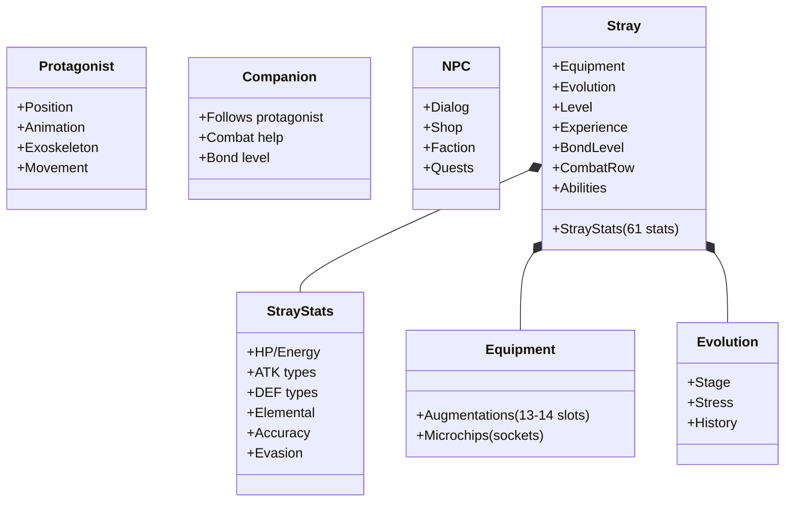

### Combat System Architecture

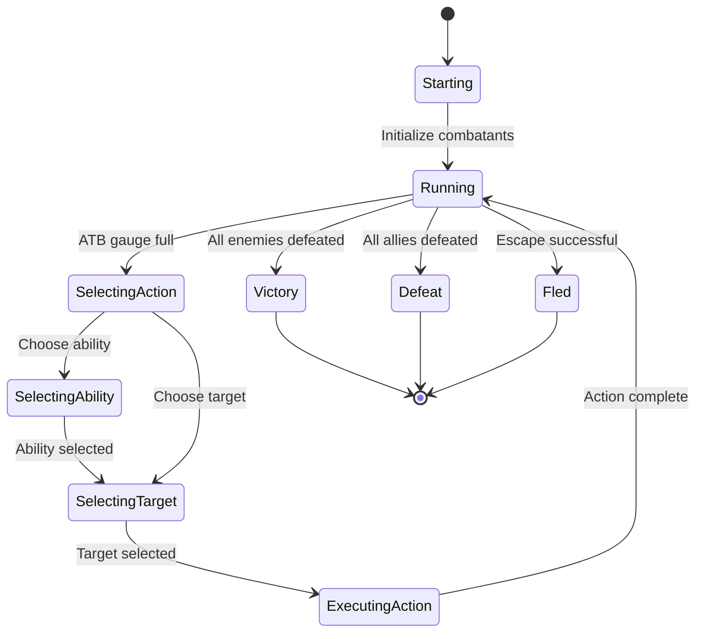

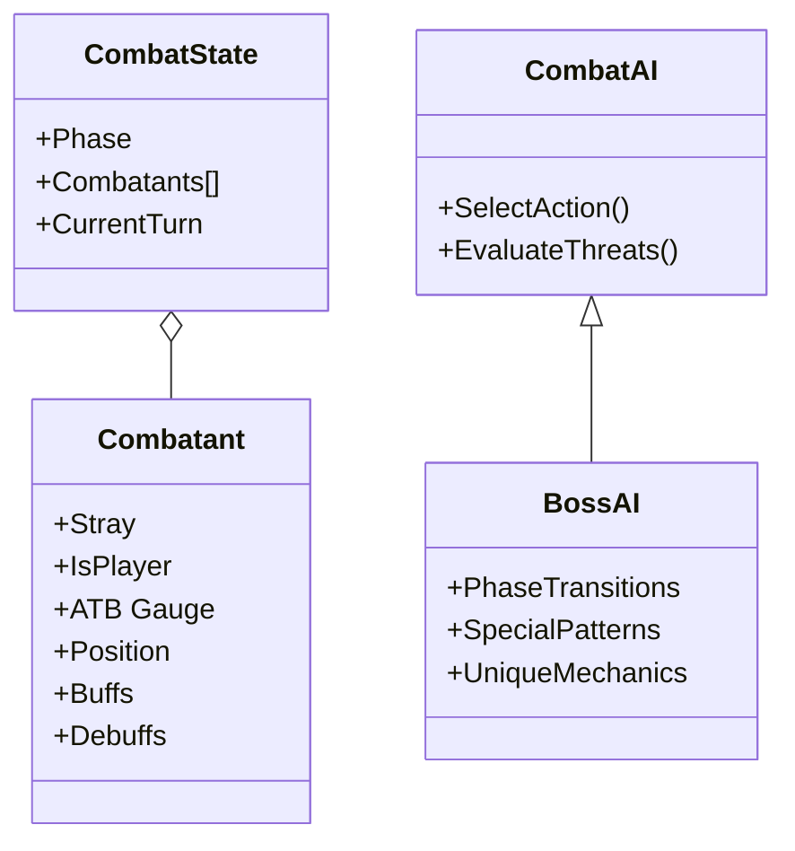

### World System Architecture

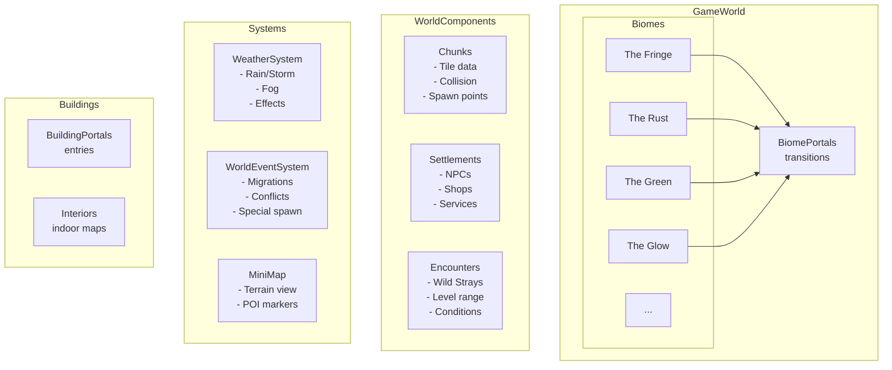

### Dungeon System Architecture

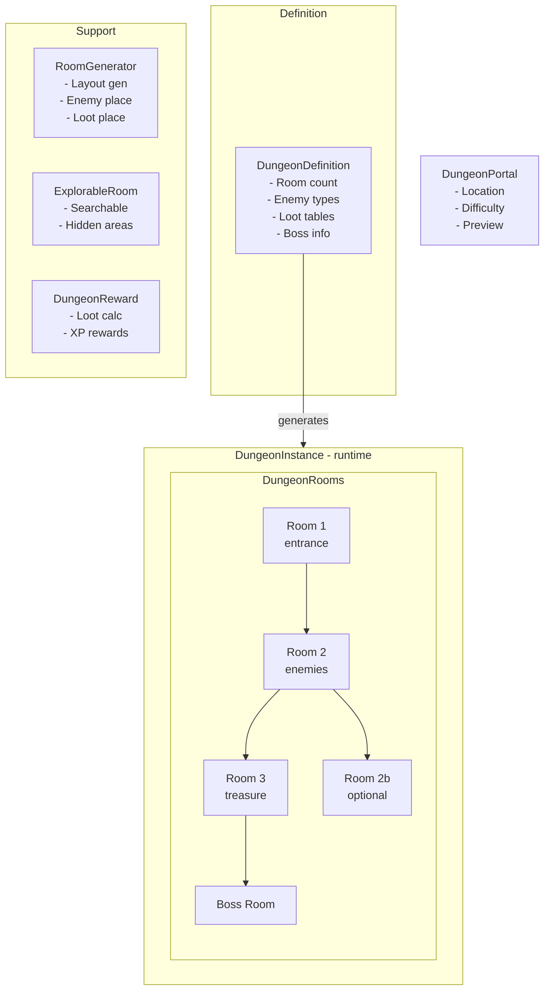

### Progression System Architecture

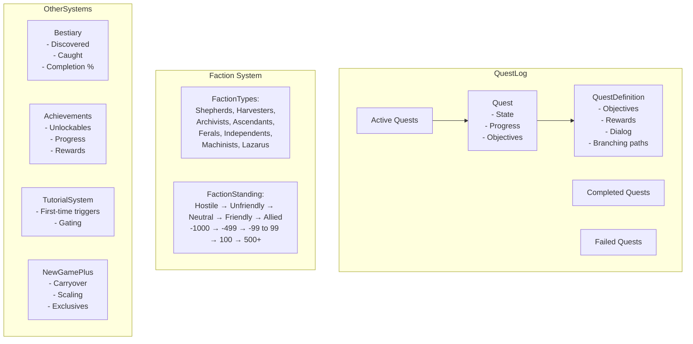

## Input System Architecture

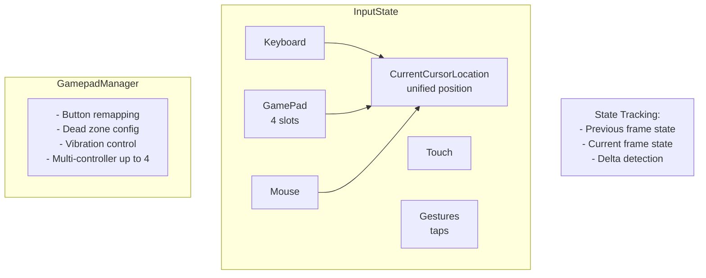

## Settings System Architecture

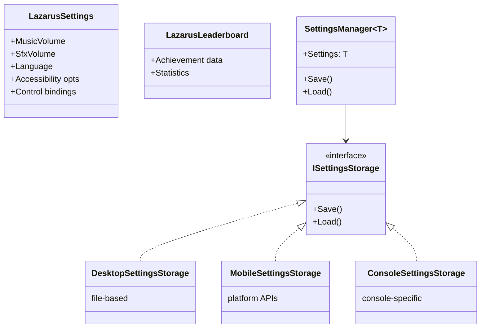

## Game State Service Architecture

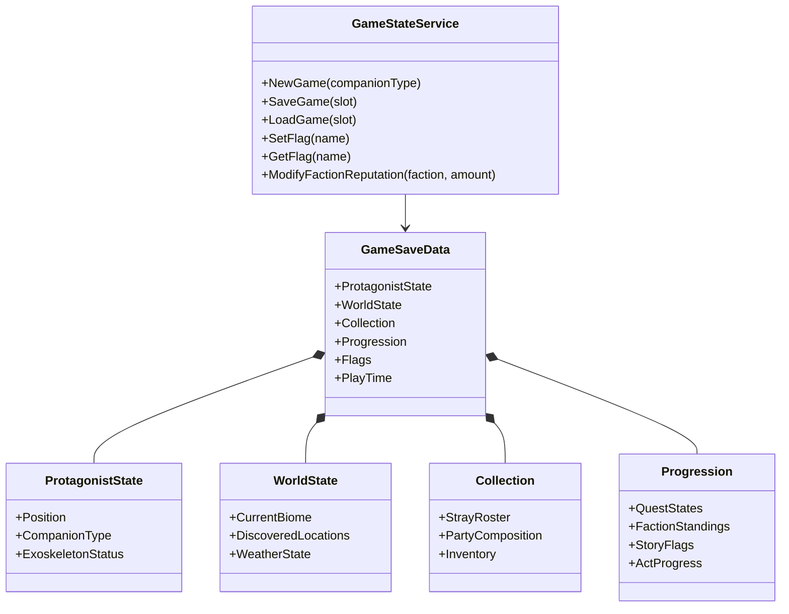

## Service Registration

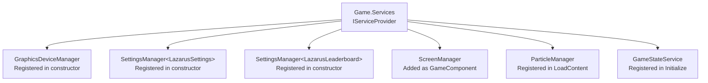

**Access pattern:**
```csharp
var gameState = game.Services.GetService<GameStateService>();
var settings = game.Services.GetService<SettingsManager<LazarusSettings>>();
```

## Platform Abstraction

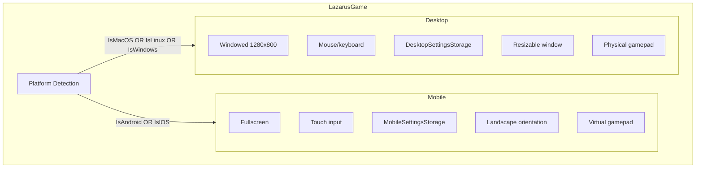

## Data Flow: Typical Gameplay Session

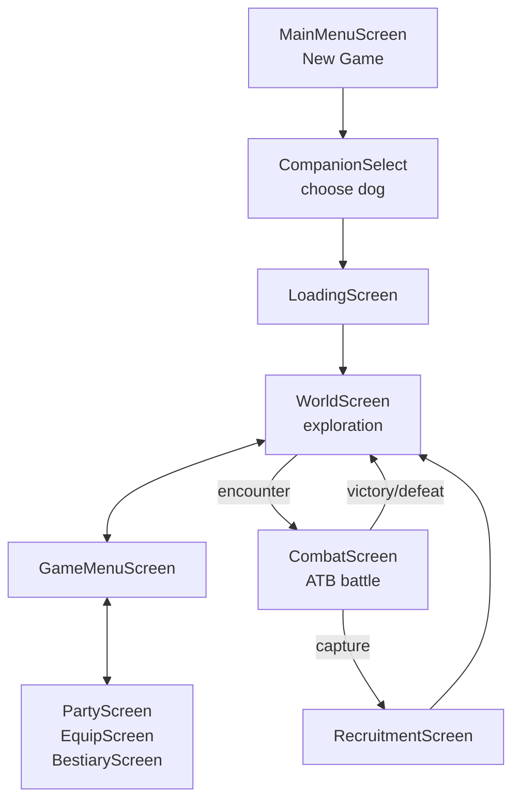
