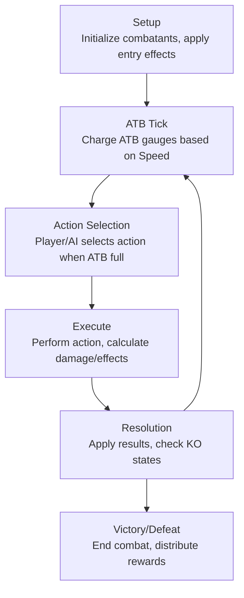
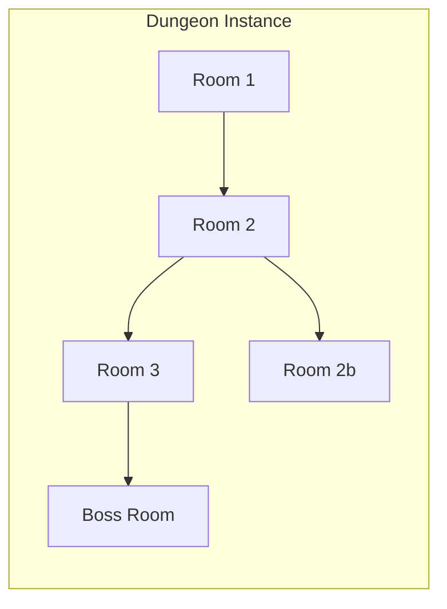
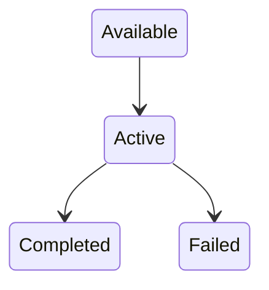
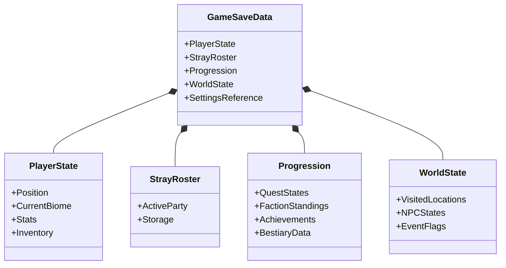
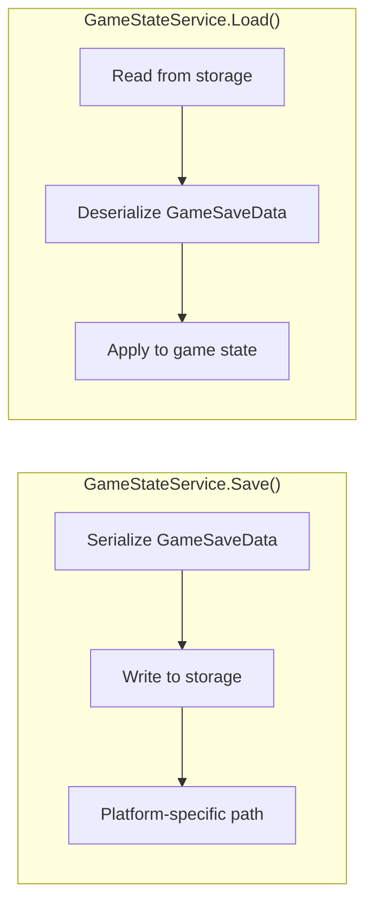
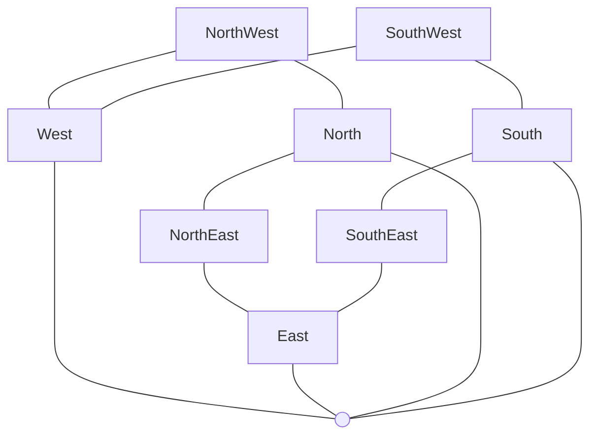

# Lazarus Game Systems Documentation

## Stray System

### Overview

Strays are cybernetic creatures that the player can collect, train, and evolve. Each Stray has extensive stats, elemental affinities, and equipment slots.

**Files**:
- `Lazarus.Core/Game/Entities/Stray.cs` - Core Stray entity class
- `Lazarus.Core/Game/Data/StrayDefinition.cs` - Stray species definitions
- `Lazarus.Core/Game/Data/StrayType.cs` - Species type enumeration
- `Lazarus.Core/Game/Data/CreatureCategory.cs` - Biological classification (Ordos)
- `Lazarus.Core/Game/Stats/StrayStats.cs` - Stats container
- `Lazarus.Core/Game/Stats/StatType.cs` - 61 stat type definitions

### Stat System

Strays have 61 different stats organized into categories:

#### Core Stats
| Stat | Description |
|------|-------------|
| `MaxHealth` | Maximum hit points |
| `CurrentHealth` | Current hit points |
| `MaxEnergy` | Energy for abilities |
| `CurrentEnergy` | Available energy |
| `Speed` | Turn order in combat (ATB charge rate) |

#### Physical Stats
| Stat | Description |
|------|-------------|
| `Attack` | Physical damage output |
| `Defense` | Physical damage reduction |
| `Evasion` | Chance to dodge attacks |
| `Accuracy` | Chance to hit with attacks |
| `CriticalChance` | Probability of critical hits |
| `CriticalDamage` | Multiplier on critical hits |

#### Elemental Damage Stats
12 damage types for offensive capabilities:
```
FireDamage, IceDamage, ElectricDamage, ToxicDamage,
PsychicDamage, RadiantDamage, ShadowDamage, SonicDamage,
AcidDamage, ForceDamage, NatureDamage, VoidDamage
```

#### Elemental Resistance Stats
12 matching resistance stats:
```
FireResistance, IceResistance, ElectricResistance, ToxicResistance,
PsychicResistance, RadiantResistance, ShadowResistance, SonicResistance,
AcidResistance, ForceResistance, NatureResistance, VoidResistance
```

#### Special Stats
| Stat | Description |
|------|-------------|
| `Loyalty` | Bond with player |
| `Corruption` | Gravitation influence |
| `Hunger` | Needs management |
| `Morale` | Emotional state |
| `Experience` | XP for leveling |
| `Level` | Current level |

#### Utility Stats
```
CarryCapacity, Stealth, Perception, Charisma,
Intimidation, Survival, Crafting, Hacking,
Scavenging, Navigation
```

### Creature Categories (Ordos)

Strays are classified into 12 biological categories:

| Ordo | Description | Example Traits |
|------|-------------|----------------|
| Colossomammalia | Megafauna mammals | High HP, strength |
| Micromammalia | Small mammals | Speed, evasion |
| Avesrex | Birds | Flight, perception |
| Squamata | Reptiles | Armor, toxins |
| Amphibria | Amphibians | Water adaptation |
| Ichthyos | Fish | Aquatic abilities |
| Arthropoda | Insects/arachnids | Swarm tactics |
| Cephalopoda | Cephalopods | Intelligence, stealth |
| Synthetix | Pure machines | Electric immunity |
| Chimera | Hybrid creatures | Mixed abilities |
| Umbral | Shadow beings | Dark powers |
| Primordial | Ancient creatures | Unique abilities |

### Stray Roster

**File**: `Lazarus.Core/Game/Entities/StrayRoster.cs`

The player maintains a roster of collected Strays:
- Active party (limited size for combat)
- Reserve storage
- Recruitment through encounters
- Release/trade mechanics

---

## Combat System

### Overview

Lazarus uses an Active Time Battle (ATB) system where turn order is determined by speed stats and time accumulation.

**Files**:
- `Lazarus.Core/Game/Combat/CombatState.cs` - Combat state machine
- `Lazarus.Core/Game/Combat/Combatant.cs` - Combat participant wrapper
- `Lazarus.Core/Game/Combat/CombatAction.cs` - Action definitions
- `Lazarus.Core/Game/Combat/Ability.cs` - Ability system
- `Lazarus.Core/Game/Combat/CombatAI.cs` - Enemy AI
- `Lazarus.Core/Game/Combat/BossAI.cs` - Boss-specific AI
- `Lazarus.Core/Screens/CombatScreen.cs` - Combat UI/rendering

### Combat Phases



### ATB (Active Time Battle) Mechanics

1. Each combatant has an ATB gauge (0-100%)
2. Gauge fills based on Speed stat
3. When gauge reaches 100%, combatant can act
4. After acting, gauge resets to 0
5. Some abilities modify ATB charge rate

### Damage Calculation

```csharp
// Base damage formula
baseDamage = attackerStat * abilityPower / defenderDefense

// Elemental modification
if (ability.Element != null)
    damage *= GetElementalMultiplier(attacker, defender, ability.Element)

// Critical hit check
if (Random() < attacker.CriticalChance)
    damage *= attacker.CriticalDamage

// Resistance application
damage *= (1.0 - defender.GetResistance(ability.Element))
```

### Combat Actions

| Action Type | Description |
|-------------|-------------|
| Attack | Basic physical attack |
| Ability | Special move using energy |
| Item | Use consumable item |
| Defend | Reduce incoming damage |
| Swap | Switch active Stray |
| Flee | Attempt to escape |

### Combat AI

**File**: `Lazarus.Core/Game/Combat/CombatAI.cs`

Standard AI behavior patterns:
- Aggressive: Prioritize damage output
- Defensive: Self-preservation focus
- Support: Buff allies, debuff enemies
- Random: Unpredictable actions

**File**: `Lazarus.Core/Game/Combat/BossAI.cs`

Boss-specific AI with:
- Phase transitions
- Special attack patterns
- Unique mechanics per boss

---

## World System

### Overview

The game world consists of interconnected biomes with procedural elements.

**Files**:
- `Lazarus.Core/Game/World/GameWorld.cs` - World container
- `Lazarus.Core/Game/World/Biome.cs` - Biome definitions
- `Lazarus.Core/Game/World/Chunk.cs` - World chunk system
- `Lazarus.Core/Game/World/Settlement.cs` - Towns/safe zones
- `Lazarus.Core/Screens/WorldScreen.cs` - Main exploration screen

### Biome Types

Each biome has distinct characteristics:
- Visual theme and tileset
- Native Stray species
- Environmental hazards
- Weather patterns
- Resource availability

### Biome Portals

**File**: `Lazarus.Core/Game/World/BiomePortal.cs`

Connections between biomes:
- Visible transition points
- May require keys/items
- Story-gated progression

### Chunk System

**File**: `Lazarus.Core/Game/World/Chunk.cs`

World divided into chunks for:
- Efficient loading/unloading
- Spawn management
- Persistent state tracking

### Settlements

**File**: `Lazarus.Core/Game/World/Settlement.cs`

Safe zones within biomes:
- No hostile encounters
- NPC interactions
- Shops and services
- Rest/healing facilities
- Quest givers

### Building Interiors

**File**: `Lazarus.Core/Game/World/Interior.cs`

Enterable buildings with:
- Separate interior maps
- NPCs and interactions
- Storage/services

**File**: `Lazarus.Core/Game/World/BuildingPortal.cs`

Handles transitions between exterior and interior spaces.

---

## Weather System

**File**: `Lazarus.Core/Game/World/WeatherSystem.cs`

### Weather Types

| Weather | Effects |
|---------|---------|
| Clear | Normal conditions |
| Rain | Water-type buff, fire debuff |
| Storm | Electric-type buff, flight penalty |
| Fog | Reduced visibility, stealth bonus |
| Sandstorm | Damage over time, accuracy penalty |
| Snow | Ice-type buff, movement penalty |
| Heatwave | Fire-type buff, stamina drain |

### Weather Mechanics

- Biome-specific weather pools
- Time-based transitions
- Combat modifier application
- Visual effect rendering

---

## Encounter System

**File**: `Lazarus.Core/Game/World/Encounter.cs`

### Encounter Types

| Type | Description |
|------|-------------|
| Random | Wild Stray encounters |
| Scripted | Story/quest encounters |
| Boss | Major story battles |
| Ambush | Surprise enemy attacks |
| Opportunity | Optional beneficial encounters |

### Encounter Rate

Factors affecting encounter frequency:
- Biome danger level
- Time of day
- Weather conditions
- Player stealth stat
- Repel items

---

## Dungeon System

### Overview

Dungeons are self-contained exploration areas with procedural elements.

**Files**:
- `Lazarus.Core/Game/Dungeons/DungeonDefinition.cs` - Dungeon templates
- `Lazarus.Core/Game/Dungeons/DungeonInstance.cs` - Active dungeon state
- `Lazarus.Core/Game/Dungeons/DungeonRoom.cs` - Room definitions
- `Lazarus.Core/Game/Dungeons/RoomGenerator.cs` - Procedural generation
- `Lazarus.Core/Game/Dungeons/DungeonPortal.cs` - Dungeon entry points
- `Lazarus.Core/Game/Dungeons/DungeonContent.cs` - Room contents
- `Lazarus.Core/Game/Dungeons/DungeonReward.cs` - Completion rewards
- `Lazarus.Core/Game/Dungeons/ExplorableRoom.cs` - Walkable dungeon areas
- `Lazarus.Core/Screens/DungeonScreen.cs` - Dungeon combat UI
- `Lazarus.Core/Screens/DungeonExplorationScreen.cs` - Dungeon exploration UI

### Dungeon Structure



### Room Types

| Room Type | Contents |
|-----------|----------|
| Combat | Enemy encounters |
| Treasure | Loot/items |
| Rest | Healing opportunity |
| Puzzle | Environmental challenge |
| Boss | Major enemy |
| Shop | Merchant NPC |

### Procedural Generation

**File**: `Lazarus.Core/Game/Dungeons/RoomGenerator.cs`

- Templates define room layouts
- Random room selection
- Connected graph generation
- Difficulty scaling by depth

### Rewards

**File**: `Lazarus.Core/Game/Dungeons/DungeonReward.cs`

Completion rewards include:
- Rare items/equipment
- Currency
- Experience bonuses
- Unique Strays
- Story progression

---

## Progression Systems

### Quest System

**Files**:
- `Lazarus.Core/Game/Progression/Quest.cs` - Quest instance
- `Lazarus.Core/Game/Progression/QuestDefinition.cs` - Quest templates
- `Lazarus.Core/Game/Progression/QuestLog.cs` - Active quest tracking
- `Lazarus.Core/Game/Progression/AdditionalQuests.cs` - Side quest definitions

#### Quest Types

| Type | Description |
|------|-------------|
| Main | Story progression |
| Side | Optional content |
| Bounty | Target elimination |
| Fetch | Item collection |
| Escort | NPC protection |
| Discovery | Exploration goals |

#### Quest States



### Faction System

**Files**:
- `Lazarus.Core/Game/Progression/Faction.cs` - Faction definitions
- `Lazarus.Core/Screens/FactionScreen.cs` - Faction UI
- `Lazarus.Core/Screens/FactionReputationScreen.cs` - Reputation display

#### Factions

| Faction | Philosophy |
|---------|------------|
| Shepherds | Protect and nurture Strays |
| Harvesters | Exploit Strays as resources |
| Archivists | Preserve knowledge |
| Ascendants | Merge with technology |
| Ferals | Reject civilization |
| Sanctum | Religious order |
| Vanguard | Military protection |
| Synthesis | Human-Stray harmony |

#### Reputation Levels


Reputation affects:
- NPC dialogue
- Shop prices
- Quest availability
- Faction-specific rewards

### Achievement System

**File**: `Lazarus.Core/Game/Progression/AchievementSystem.cs`

Tracks player accomplishments:
- Collection milestones
- Combat achievements
- Exploration progress
- Story completions

### Bestiary (Ledger)

**File**: `Lazarus.Core/Game/Progression/Bestiary.cs`

Pokédex-style creature catalog:
- Discovered species
- Capture status
- Stat ranges
- Habitat information
- Lore entries

**Screen**: `Lazarus.Core/Screens/BestiaryScreen.cs`

### Tutorial System

**File**: `Lazarus.Core/Game/Progression/TutorialSystem.cs`

Contextual guidance for new players:
- Progressive introduction
- Skippable tutorials
- Completion tracking

### New Game Plus

**File**: `Lazarus.Core/Game/Progression/NewGamePlus.cs`

Post-completion features:
- Carry-over options
- Increased difficulty
- New content unlocks

---

## Equipment System

### Augmentations

**Files**:
- `Lazarus.Core/Game/Items/Augmentation.cs` - Augmentation items
- `Lazarus.Core/Game/Items/AugmentationSlots.cs` - Slot definitions
- `Lazarus.Core/Screens/EquipmentScreen.cs` - Equipment UI

#### Augmentation Slots

Strays have 13-14 equipment slots:

| Slot | Description |
|------|-------------|
| Head | Sensory/cognitive augments |
| Eyes | Visual enhancements |
| Ears | Audio enhancements |
| Torso | Core body augments |
| Back | Mounted equipment |
| LeftArm | Left limb augment |
| RightArm | Right limb augment |
| LeftLeg | Left limb augment |
| RightLeg | Right limb augment |
| Tail | Tail augment (if applicable) |
| Internal | Internal systems |
| Core | Central processor |
| Dermal | Skin/armor layer |

#### Augmentation Effects

- Stat modifications
- New abilities
- Passive bonuses
- Visual changes

### Microchips

**File**: `Lazarus.Core/Game/Items/Microchip.cs`

Socketable items for augmentations:
- Socket compatibility
- Firmware levels
- Stacking effects
- Upgrade paths

---

## NPC and Dialog System

### NPCs

**File**: `Lazarus.Core/Game/Entities/NPC.cs`

Non-player characters with:
- Faction affiliation
- Dialog trees
- Shop functionality
- Quest connections

**File**: `Lazarus.Core/Game/Data/NPCDefinition.cs`

NPC template definitions.

### Dialog System

**Files**:
- `Lazarus.Core/Game/Dialog/Dialog.cs` - Dialog container
- `Lazarus.Core/Game/Dialog/DialogLine.cs` - Individual dialog entries
- `Lazarus.Core/Screens/DialogScreen.cs` - Dialog UI

#### Dialog Features

- Branching conversations
- Condition-based options
- Reputation influence
- Quest integration

---

## Evolution System

**Files**:
- `Lazarus.Core/Game/Entities/Evolution.cs` - Evolution definitions
- `Lazarus.Core/Game/Entities/EvolutionSystem.cs` - Evolution mechanics

### Evolution Requirements

Strays evolve when conditions are met:
- Level threshold
- Stat requirements
- Item usage
- Location-specific
- Time-of-day
- Faction reputation

### Evolution Effects

- New form/appearance
- Stat changes
- Ability unlocks
- Type modifications

---

## Recruitment System

**File**: `Lazarus.Core/Game/Entities/RecruitmentCondition.cs`

### Recruitment Methods

| Method | Description |
|--------|-------------|
| Capture | Weaken and capture wild Strays |
| Befriend | Build trust over time |
| Trade | Exchange with NPCs |
| Quest | Reward for quest completion |
| Purchase | Buy from merchants |
| Egg | Hatch from found eggs |

### Recruitment Conditions

Factors affecting capture success:
- Target HP percentage
- Status effects
- Capture item quality
- Player skill bonuses
- Stray rarity

---

## Companion System

**File**: `Lazarus.Core/Game/Entities/Companion.cs`
**File**: `Lazarus.Core/Game/Data/CompanionType.cs`

Story-relevant NPCs that:
- Travel with player
- Provide bonuses
- Have personal quests
- React to story events

---

## Shop System

**File**: `Lazarus.Core/Game/Items/Shop.cs`
**Screen**: `Lazarus.Core/Screens/TradingScreen.cs`

### Shop Features

- Buy/sell items
- Faction-modified prices
- Limited stock
- Restocking timers
- Special rare items

---

## Story System

### Cutscenes

**Files**:
- `Lazarus.Core/Game/Story/CutsceneSystem.cs` - Cutscene management
- `Lazarus.Core/Game/Story/CutsceneScripts.cs` - Cutscene content

Features:
- Scripted sequences
- Character animations
- Dialog integration
- Skippable segments

### Endings

**File**: `Lazarus.Core/Game/Story/EndingSystem.cs`
**Screen**: `Lazarus.Core/Screens/EndingScreen.cs`

Multiple endings based on:
- Story choices
- Faction alignment
- Collection completion
- Hidden conditions

### Act Structure

**File**: `Lazarus.Core/Game/Data/ActState.cs`

Story divided into acts:
- Act transitions
- World state changes
- NPC availability shifts

---

## World Events

**File**: `Lazarus.Core/Game/World/WorldEventSystem.cs`

Dynamic events that occur:
- Timed events
- Triggered events
- Random occurrences
- Seasonal content

---

## Gravitation System

**File**: `Lazarus.Core/Game/Data/GravitationStage.cs`

Corruption/influence mechanic:
- Stage progression
- Behavioral changes
- Story implications
- Reversibility conditions

---

## Save System

**File**: `Lazarus.Core/Game/Data/GameSaveData.cs`
**File**: `Lazarus.Core/Services/GameStateService.cs`

### Save Data Contents



### Save/Load Flow



**Screen**: `Lazarus.Core/Screens/SaveLoadScreen.cs`

---

## Particle Effects

**Files**:
- `Lazarus.Core/Effects/ParticleManager.cs` - Particle system
- `Lazarus.Core/Effects/Particle.cs` - Individual particle
- `Lazarus.Core/Effects/ParticleEffectType.cs` - Effect definitions

### Effect Types

| Effect | Usage |
|--------|-------|
| Confetti | Celebrations |
| Explosion | Combat impacts |
| Fireworks | Major achievements |
| Sparkles | Item pickups |

### Particle Properties

- Position/velocity
- Color/opacity
- Scale/rotation
- Lifetime
- Cascade effects (secondary spawns)

---

## Audio System

**File**: `Lazarus.Core/Audio/AudioManager.cs`

### Audio Categories

| Category | Implementation |
|----------|----------------|
| Music | `MediaPlayer` (streaming) |
| SFX | `SoundEffect` (buffered) |
| Ambient | Looping environmental sounds |
| UI | Interface feedback |

### Audio Controls

- Volume per category
- Mute toggles
- Crossfade transitions
- Positional audio (planned)

### Subtitles

**File**: `Lazarus.Core/Audio/SubtitleDisplay.cs`

Accessibility feature for audio content.

---

## Accessibility

**File**: `Lazarus.Core/Accessibility/AccessibilitySettings.cs`

### Features

- Font size scaling
- High contrast mode
- Colorblind options
- Subtitle support
- Input remapping
- Difficulty adjustments

**Screen**: `Lazarus.Core/Screens/AccessibilityScreen.cs`

---

## Input System

**Files**:
- `Lazarus.Core/Inputs/InputState.cs` - Input abstraction
- `Lazarus.Core/Inputs/GamepadManager.cs` - Controller support
- `Lazarus.Core/Inputs/VirtualGamePad.cs` - Touch controls
- `Lazarus.Core/Inputs/TouchCollectionExtensions.cs` - Touch helpers

### Supported Input

| Platform | Input Methods |
|----------|---------------|
| Desktop | Keyboard, Mouse, Gamepad |
| Mobile | Touch, Virtual Gamepad |

### Input Configuration

**Screen**: `Lazarus.Core/Screens/InputSettingsScreen.cs`

Remappable controls with:
- Per-action binding
- Multiple inputs per action
- Controller profile support

---

## Localization

**Files**:
- `Lazarus.Core/Localization/LocalizationManager.cs` - Language management
- `Lazarus.Core/Localization/GameStrings.cs` - String access
- `Lazarus.Core/Localization/Resources.resx` - Default strings
- `Lazarus.Core/Localization/Resources.{locale}.resx` - Translations

### Supported Languages

| Code | Language |
|------|----------|
| en-US | English (default) |
| de-DE | German |
| es-ES | Spanish |
| fr-FR | French |
| ja-JP | Japanese |

### Usage

```csharp
// Access localized string
var text = LocalizationManager.Instance.GetString("key");

// Or via GameStrings helper
var text = GameStrings.MenuStart;
```

**Screen**: `Lazarus.Core/Screens/LanguageScreen.cs`

---

## Map System

### Tiled Integration

**File**: `Lazarus.Core/Game/TiledMap.cs`

Supports Tiled editor exports:
- Multiple tile layers
- Object layers (spawns, triggers)
- External tilesets (.tsx)
- CSV tile data encoding

### Mini Map

**File**: `Lazarus.Core/Game/World/MiniMap.cs`

Real-time map display:
- Player position
- Discovered areas
- Points of interest
- Quest markers

**Screen**: `Lazarus.Core/Screens/BiomeMapScreen.cs`

---

## Animation System

### Standard Animation

**File**: `Lazarus.Core/Game/Animation.cs`

Frame-based animation:
- Sprite sheet support
- Configurable frame time
- Looping options

**File**: `Lazarus.Core/Game/AnimationPlayer.cs`

Animation playback controller.

### Directional Animation

**File**: `Lazarus.Core/Game/DirectionalAnimation.cs`

8-direction animation support:
- Per-direction sprite sets
- Direction transitions
- Walk/run/idle states

**File**: `Lazarus.Core/Game/DirectionalAnimationPlayer.cs`

Manages direction-aware playback.

### Direction System

**File**: `Lazarus.Core/Game/Direction.cs`



---

## Protagonist

**File**: `Lazarus.Core/Game/Entities/Protagonist.cs`

The player character with:
- Movement controls
- Animation states
- Interaction handling
- Inventory access
- Party management
